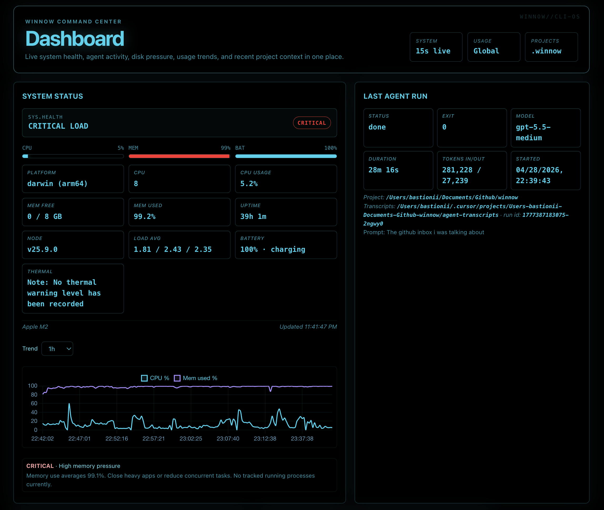
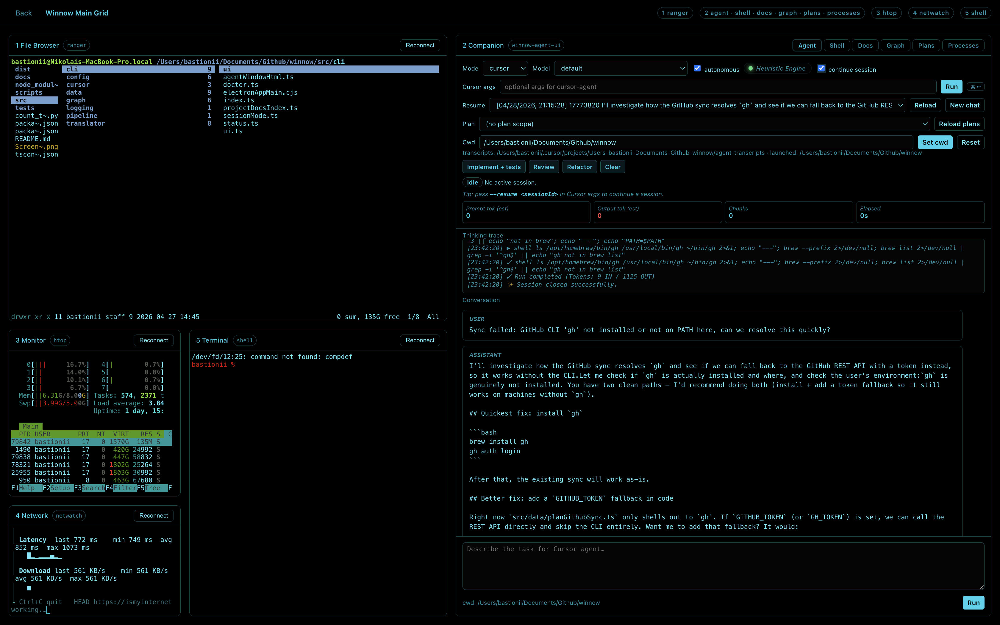
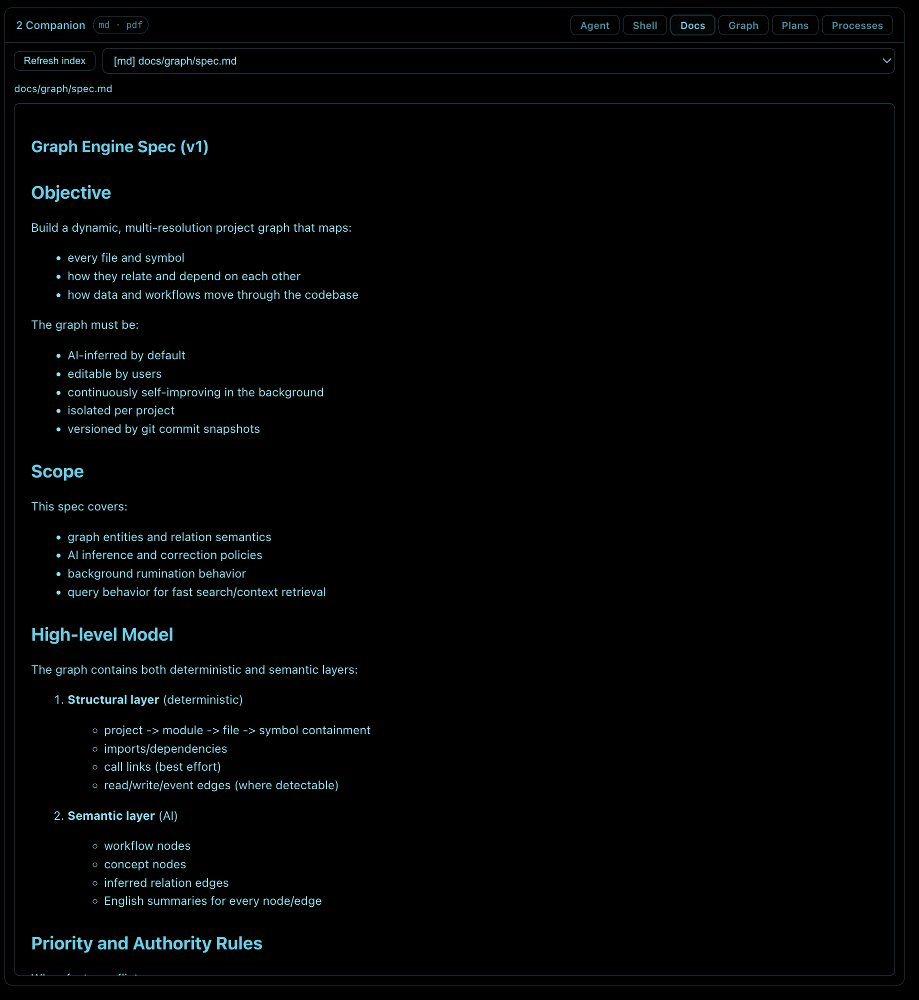
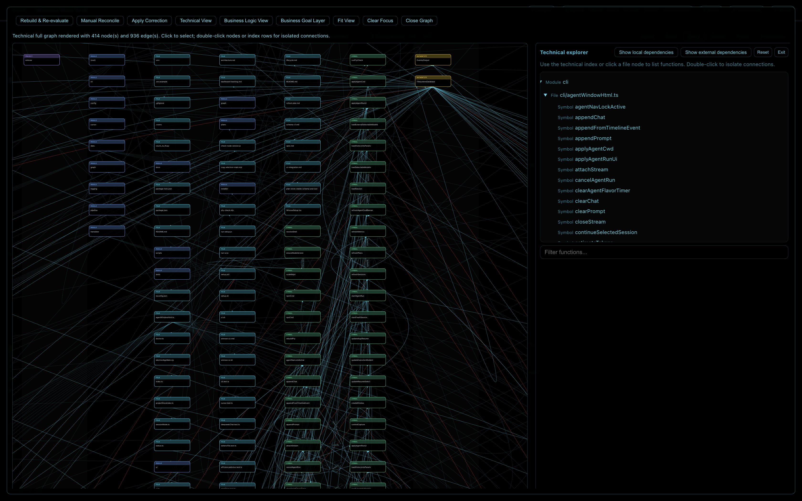
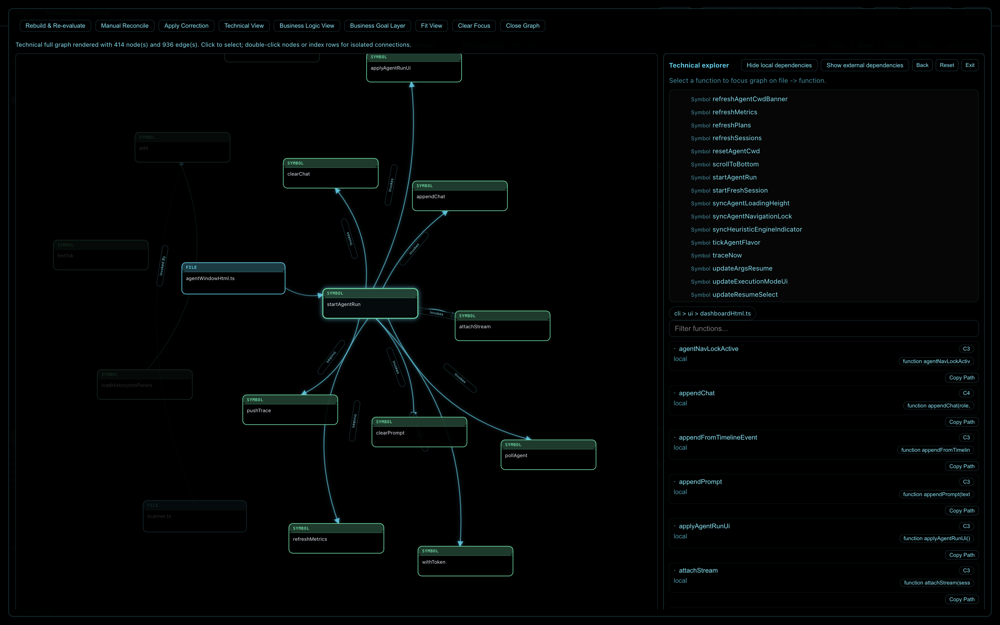
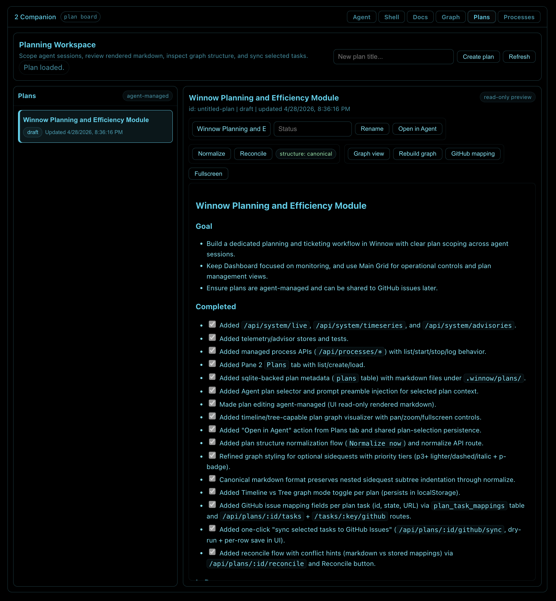
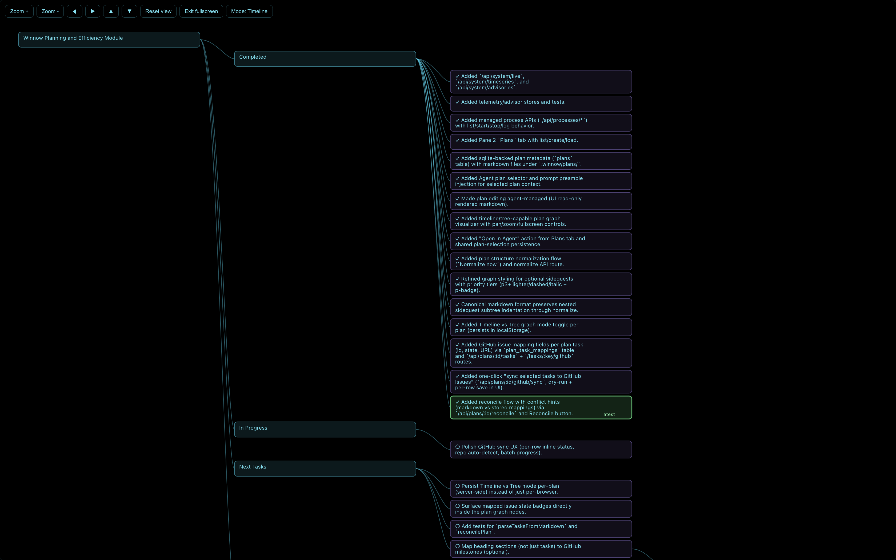
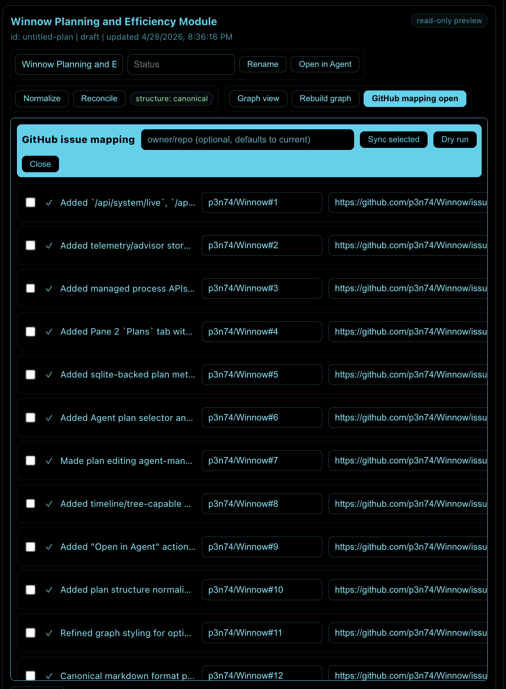
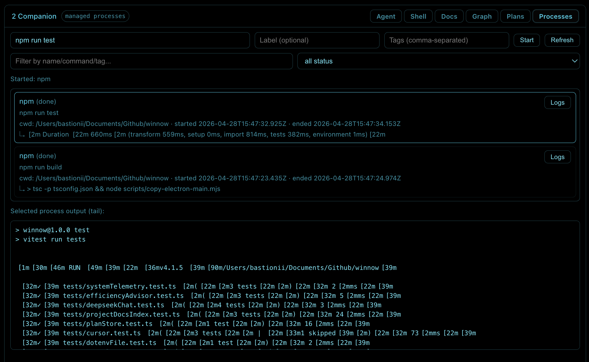

# Winnow

Winnow is an AI-first local IDE shell for serious builders.

It combines a curated set of AI workflows, terminal shortcuts, session continuity, and operational tooling into one place, so you can move from idea to patch to validation fast. Think of it as your personal high-leverage interface on top of `cursor-agent`: tuned for speed today, designed as a framework for more advanced AI experiments tomorrow.

## Vision

Most AI coding tools are either:
- great at chat but weak at execution, or
- powerful in the terminal but fragmented across too many commands and panes.

Winnow closes that gap:
- **IDE-like flow** with dashboard, agent workspace, docs and graph views, and a multi-pane terminal grid
- **Workflow density** through cherry-picked shortcuts and fast paths
- **Session continuity** so context is never lost between runs
- **Experiment surface** for evolving into advanced autonomous/agentic patterns

## Why users pick Winnow

- **One cockpit, fewer context switches**: monitor system, run agents, inspect transcripts, view docs, and manage terminals in a single UI.
- **Built for execution, not demos**: run real prompts, stream events, inspect status, and cancel/stop safely.
- **Fast resume loops**: pull prior sessions, reuse prompts, and continue with intent.
- **Opinionated where it matters**: practical defaults, focused controls, and quick actions that remove friction.
- **Extensible by design**: `.winnow` workspace data, local session artifacts, and modular CLI/UI code make experimentation straightforward.

## Visual tour

| Dashboard | Main grid |
| --- | --- |
|  |  |
| Live system health, recent agent activity, usage context, and project status in one command center. | A multi-pane operating surface with terminal tools on the left and agent, shell, docs, graph, plans, and process controls on the right. |

| Docs | Project graph |
| --- | --- |
|  |  |
| Indexed Markdown and PDF docs render inside the companion pane, keeping project reference material close to the work. | The technical graph exposes files, symbols, dependencies, and business views for faster codebase navigation. |

| Focused graph | Planning workspace |
| --- | --- |
|  |  |
| Drill into a symbol or file to inspect local and external dependencies without losing surrounding context. | Agent-managed plans keep goals, completed work, next tasks, graph views, and GitHub mapping in the workspace. |

| Plan timeline | GitHub issue mapping |
| --- | --- |
|  |  |
| Timeline and tree views turn plans into navigable execution maps with completed, active, and next-task sections. | Plan tasks can be mapped to GitHub issues, synced selectively, and previewed before changes are pushed upstream. |

| Managed processes |
| --- |
|  |
| Start, track, filter, and inspect long-running commands from the same companion pane used for agent work. |

## Features

### CLI and sessions

- **Default command** — forwards arguments to `cursor-agent` (override with `--cursor-command`).
- **`winnow session`** — interactive prompt with runtime toggles for translation and execution options.
- **`winnow doctor` / `winnow status`** — health checks for the agent binary and translator backends; quick runtime snapshot.
- **Optional translation** — Ollama or DeepSeek API backends, profiles (`learning_zh`, `engineering_exact`), and separate input/output translation modes (see `--help` on the root command).

### Web companion UI (`winnow ui`)

- **Dashboard** — system snapshot, disk summary, registered projects, usage runs and filters, and the last agent run recap.
- **Agent workspace** — selectable models (including externally advertised lists where configured), resume picker for prior sessions, execution-mode style controls, streaming run timeline (thinking + chat), and run / cancel / stop wired to the agent API. Optional **Heuristic Engine** mode injects ranked project-graph context to narrow agent scope before broad repository scans.
- **Main grid** — five configurable terminal panes (xterm + WebSocket PTYs), per-pane reconnect, and a **Workspace** companion with tabs for agent runs, shell, **Docs**, **Graph**, **Plans**, and **Processes**.
- **Docs** — workspace-wide index of Markdown and PDF (`.winnow/docs-index.json`), refresh/reindex, rendered Markdown (sanitized) and in-browser PDF.
- **Project graph** — SQLite-backed graph service exposed over HTTP: summary, nodes/edges, neighborhood expansion, rebuild/reconcile, corrections, and business-logic views; the grid UI supports technical vs business graph modes and file→function exploration.
- **Planning workspace** — agent-managed plans stored under `.winnow/plans`, rendered as Markdown, normalized/reconciled through API flows, visualized as timeline/tree graphs, and mapped to GitHub issues when configured.
- **Managed processes** — start and monitor named commands, filter by status/tags, and inspect logs without leaving the companion pane.
- **Workspace** — current working directory controls (with optional Cursor workspace bootstrap under `.cursor/`), git change list, and selective **stage** actions.
- **Files** — directory listing, preview, and “open in editor” helpers from the UI server.
- **Shared / LAN use** — optional `?token=…` gate and bindable `--host` (token auto-generated when binding `0.0.0.0` without one).

### Data on disk

- Agent sessions under `.winnow/sessions`, JSONL logs under `.winnow/logs`, docs index and graph database under `.winnow` (see **Storage and project artifacts** below).
- Cursor transcript paths under `~/.cursor/projects/…` when syncing or resuming from IDE runs.

## What's new

Recent highlights (newest first; use `git log` for the full story):

- **Heuristic Engine** — graph-derived concept, workflow, file, and symbol hints are ranked against the user prompt, then prepended as a compact navigation seed. This guides the agent toward likely-relevant code paths first, reducing discovery time and making large-codebase workflows more targeted.
- **Project graph** — HTTP APIs plus an interactive graph in the main grid (technical / business layers, neighborhood drill-down, corrections workflow).
- **Planning and execution** — agent-managed plan boards, timeline/tree graph views, GitHub issue mapping, and a managed process runner are available from the main grid companion.
- **Providers and models** — external provider hooks, smoke checks from the UI, and selectable model lists (including externally advertised models when configured).
- **Docs in the UI** — indexed Markdown and PDF with refresh, rendered in the Workspace **Docs** tab.
- **Agent lifecycle** — clearer loading and run states, cancel/stop endpoints, and tighter resume and execution-mode controls in the agent UI.
- **Windows support** — `npm run setup` and the Inno Setup `.exe` installer provision the Windows command wrapper, Git Bash PTY dependency, and Cursor Agent CLI path.
- **Setup and runtime** — Node version policy, PTY/shell behavior, and navigation guards polished for day-to-day use.

## Quickstart

### 1) Setup

```bash
npm run setup
```

On macOS, Homebrew installs `ranger` and `htop`. The **Cursor Agent CLI** (`cursor-agent`, from [cursor.com/install](https://cursor.com/install)) is installed next (not the Cursor desktop app).

Setup also installs a **`winnow-ui`** command: a symlink in `~/.local/bin/winnow-ui` → `scripts/winnow-ui.sh`, which runs **`npm run ui -- --shell`** from the repo (embedded Electron window). Ensure `~/.local/bin` is on your `PATH` (the Cursor CLI installer uses the same convention on macOS/Linux).

Pane 4 defaults to a `netwatch` command if present on your `PATH`; that is a separate custom tool and is **not** installed by this script.

On Windows, `npm run setup` runs `scripts/setup.ps1`, which uses **winget** for Node.js LTS and Git for Windows, then installs the **Cursor Agent CLI** from [cursor.com/install?win32=true](https://cursor.com/install?win32=true) (not the Cursor desktop app). It also writes **`%USERPROFILE%\.local\bin\winnow-ui.cmd`** with the same behavior; add that folder to your user `PATH` if it is not already there.

Native modules need a local build toolchain (Visual Studio Build Tools with “Desktop development with C++”, or the standalone MSVC toolchain) if `npm rebuild node-pty` fails.

If you prefer manual setup:

```bash
npm install
```

Use **Node.js 20 or newer** (current or LTS is fine).

### 2) Run CLI

```bash
npm run dev -- --help
```

Useful checks:

```bash
npm run doctor
npm run status
```

### 3) Launch the IDE UI

```bash
npm run ui
```

After setup, from any directory (with `~/.local/bin` on `PATH`):

```bash
winnow-ui
```

Or directly:

```bash
npm run dev -- ui
```

Optional UI flags:

- `-- --port 3210`
- `-- --host 0.0.0.0`
- `-- --token ABC123` (access via `?token=ABC123`)
- `-- --no-open` (print the URL only; open it yourself)
- `-- --shell` (open the same UI in a **standalone Electron window** instead of your default browser; first run may download Electron via `npx`)
- `-- --pane1-cmd "ranger"`
- `-- --pane2-cmd "cursor-agent"`
- `-- --pane3-cmd "htop"`
- `-- --pane4-cmd "netwatch"`
- `-- --pane5-cmd "$SHELL"`

### Windows installer (.exe)

1. Install [Inno Setup](https://jrsoftware.org/isinfo.php) so `iscc` is on your `PATH`.
2. From the repo root, compile:

```bat
iscc scripts\installer\WinnowSetup.iss
```

3. Run the generated `dist-installer\WinnowSetup-1.0.0.exe`. It copies the app under `%LOCALAPPDATA%\Programs\Winnow` and runs `scripts\setup.ps1` once at the end of setup.

## Requirements

- **Cursor Agent CLI** (`cursor-agent` on `PATH`; setup installs it via Cursor’s official installer — sign in when the CLI prompts you)
- `ranger` on `PATH` (pane 1 default)
- `htop` on `PATH` (pane 3 default)
- Pane 4 defaults to `netwatch` only if you install that yourself (or pass `--pane4-cmd` with another program)
- **Windows:** Git for Windows (`bash.exe`) so the main terminal grid can spawn PTYs; optional tools like `ranger` / `htop` are not installed by the Windows script (use WSL, Scoop, or custom pane commands)

## Storage and project artifacts

- Local agent sessions: `.winnow/sessions`
- Runtime logs: `.winnow/logs` (JSONL)
- Docs index (Markdown/PDF catalog): `.winnow/docs-index.json`
- Project graph (SQLite): `.winnow/graph/` (see `docs/graph/schema-v1.md`)
- Cursor transcript sync default:
  `~/.cursor/projects/<workspace-id>/agent-transcripts`

## For builders and experimenters

Winnow is intentionally moving beyond “wrapper” territory. It is becoming:
- a personal AI IDE layer optimized for real software work,
- a repeatable workflow engine for rapid coding loops,
- and a foundation for advanced AI orchestration experiments.

If you want an environment that reflects how *you* actually build with AI, Winnow is that environment.
